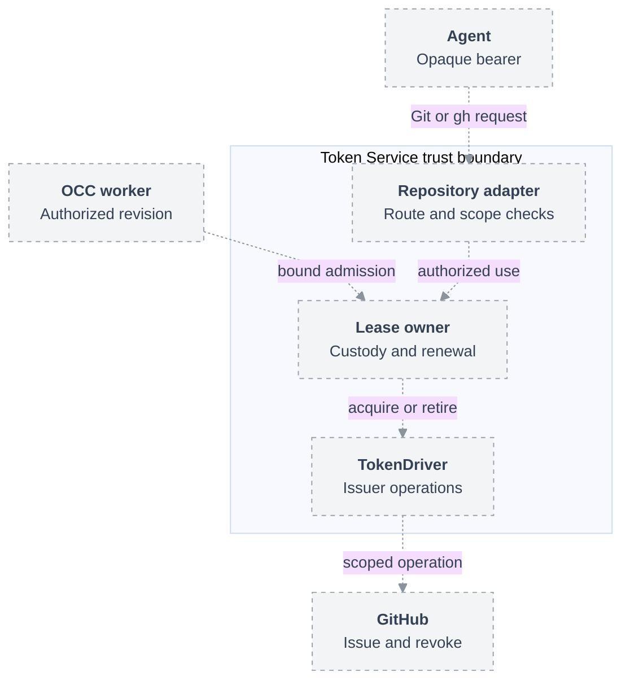

# Proposal: Generic Token Service and pluggable token leasing

- **ID:** RFC-0056
- **Owner:** OCE maintainers
- **Created:** 2026-10-02
- **Related:** [Repository credentials](31-repository-credentials/index.md), [recovery](39-repository-credential-recovery.md), [credential injection](39-sandbox-credential-injection.md)

## Summary

Refactor the repository credential broker into an Installation-scoped **Token
Service** that owns bounded leases, credential custody, replacement, and cleanup.
Named **TokenDriver** instances implement upstream issuance and revocation;
`GitHubTokenDriver` is the first implementation. Keep repository discovery,
Git/`gh` routing, and repository permission checks in the existing RepoDriver and
repository gateway adapter. Agents receive opaque lease credentials; upstream
tokens remain inside the trusted service.

This is a proposed architecture and YAML extension, not supported configuration.
It extends the current credential lifecycle rather than introducing an alternative
Agent execution or authorization system. A separate implementation plan follows
review of this decision.

## Motivation and scope

The [current broker](../../docs/reference/repository-credentials.md) already
separates session duration from GitHub token lifetime. It replaces tokens on
demand, preserves the original grant, and distinguishes local closure from
confirmed disposal. However, its private
[Backend interface](../../apps/controller/src/drivers/repo/credentials/backend-contracts.ts)
combines token acquisition and retirement with HTTP planning and authentication.
Reusing leasing for another issuer would otherwise reproduce repository-specific
policy, sessions, and recovery.

The decision separates these responsibilities without weakening existing
guarantees. First delivery must carry the regular Agent repository workflow
through the generic service, including renewal, stop, deletion, and recovery.
It does not replace SecretDriver, ServiceAccountDriver, or
[CredentialGatewayDriver](../../docs/reference/drivers/credential-gateway.md).
General model inference, new Sandbox support, arbitrary HTTP forwarding,
interactive OAuth login, raw-token delivery, and a general public token API are outside first
delivery. OAuth below demonstrates the extension seam; it is not a second
promised integration without a supported caller.

## Ownership

| Owner                         | Responsibility                                                                                                          |
| ----------------------------- | ----------------------------------------------------------------------------------------------------------------------- |
| OCC and selected IAM Driver   | Authorize Agent operations; freeze owner, grant, and deadline; persist admission and cleanup intent.                    |
| Token Service                 | Validate bound admission; own lease credentials, token custody, scheduling, capacity, and durable action outcomes.      |
| TokenDriver                   | Normalize issuer-specific grants; acquire replacement tokens; report actual scope, expiry, revocation, and uncertainty. |
| Repository gateway adapter    | Validate Git/`gh` requests and destinations; use a lease internally; preserve existing response filtering.              |
| RepoDriver and GitHub Backend | Project repository choices, resolve profiles, and coordinate leases through the private service client.                 |
| Compute Driver                | Deliver only revision-owned client material; withdraw it during retirement.                                             |

The first service stays in the existing worker-sidecar deployment with its
private Unix control socket and HTTPS repository listener. No new public minting
endpoint or Agent-to-OCC workload authentication is assumed. Existing
[workload-token authentication remains planned](../../docs/design.md#implementation-status).

## Installation YAML

Merge this proposed fragment into a complete Installation. Existing required
Configuration, IAM, Compute, and Secret selections are omitted. IDs and paths
are illustrative; files are operator-provisioned mounts.

```yaml
tokenService:
  id: installation-tokens
  controlSocket: /run/openclaw/token-control/private/control.sock
  gateway:
    publicOrigin: https://credentials.example.internal
    tlsCertFile: /run/token-service/tls.crt
    tlsKeyFile: /run/token-service/tls.key
  custody:
    encryptionKeyFile: /run/token-service/custody-key
  leasePolicy:
    maximumDurationSeconds: 86400
    credentialMarginSeconds: 60
    refreshBeforeExpirySeconds: 300
  drivers:
    - id: github-production
      type: github-app
      configuration:
        appId: "123456"
        privateKeyFile: /run/token-service/github-app.pem
    - id: graph-production
      package: "@example/oce-oauth-token-driver"
      configuration:
        tokenEndpoint: https://login.microsoftonline.com/example-tenant/oauth2/v2.0/token
        clientId: example-client-id
        clientSecretFile: /run/token-service/graph-client-secret
  grants:
    - id: platform-read
      driverId: github-production
      namespaces: ["11111111-1111-4111-8111-111111111111"]
      audience: repository-gateway
      parameters:
        installationId: "789012"
        repositoryId: "345678"
        repository: example/platform
        profile: git-read
    - id: graph-read
      driverId: graph-production
      namespaces: ["11111111-1111-4111-8111-111111111111"]
      audience: graph-gateway
      parameters:
        grantType: client_credentials
        scopes: ["https://graph.microsoft.com/.default"]

backend:
  - id: github-primary
    type: github
    configuration:
      tokenServiceId: installation-tokens
      repositories:
        - repositoryRef: platform
          profiles:
            git-read: platform-read
    drivers:
      repo: repository-credentials
drivers:
  repo:
    id: repository-credentials
    configuration:
      sessionDurationSeconds: 86400
      publicCaPath: /etc/openclaw/token-service/ca.crt
```

`tokenService` is optional and singular. Its `drivers` collection is a private
service registry, not an array-valued replacement for the existing singleton
`drivers.<capability>` selectors. `backend[].drivers.repo` retains exact Backend
membership. The GitHub Backend references the service and maps repository
profiles to grants instead of owning a second grant registry. Mapping validation
requires the GitHub issuer, numeric repository identity, and profile to agree.

Each token Driver selects exactly one bundled `type` or installed `package`.
The example OAuth package and `graph-gateway` adapter are hypothetical. Without a
registered adapter, startup rejects that grant; omit both the graph Driver and
grant for first delivery. GitHub profiles reuse the current exact permission
maps. OAuth `.default` uses administrator-approved application permissions; it
does not prove narrower scope by itself, and its Driver must validate the
configured application authority before admitting a lease.

Grant IDs and Driver IDs are unique within the Installation. `namespaces`
contains exact platform Namespace IDs, not Kubernetes namespace names. Unknown
fields, missing references, unsupported audiences, invalid duration bounds, and
incompatible profile mappings fail startup. No wildcard Namespace admission.
These allowlists constrain issuance; they do not substitute for IAM grants.

The API, worker, and service consume one immutable configuration version and
canonical grant fingerprints. Deployment validation uses the selected service
packages to emit the public grant catalog; the service verifies the catalog and
advertises its digest before admission. API/worker load that nonsecret catalog;
only the Token Service loads issuer packages and private files. Fingerprints cover
Driver implementation, issuer identity, normalized parameters, Namespace policy,
audience, duration policy, and authorization generation. Changing authority
revokes old admission; rotating an equivalent signing key need not change scope.
Retiring Drivers remain available for cleanup until their obligations settle.

The service preserves protected-file, TLS, queue, byte, and timeout limits from
the existing broker. Operational capacity overrides retain their current
bounded semantics; this RFC changes neither their values nor enforcement.

## Lease contract and lifecycle

A lease is permission for one consumer to use one immutable grant until an
absolute deadline. Its owner is `(installationId, namespaceId, agentId,
revisionId)`. It has `leaseId`, `admissionId`, `grantId`, `grantFingerprint`,
`audience`, `deadline`, and nonsecret status. Token generations have separate
issuer expiry and cleanup obligations. A lease is not an upstream token.

The trusted private client exposes:

| Operation                   | Result and authority                                                                            |
| --------------------------- | ----------------------------------------------------------------------------------------------- |
| `openLease(boundAdmission)` | Persisted owner/grant/deadline required; returns opaque client material once.                   |
| `leaseStatus(leaseId)`      | Owner-scoped status and cleanup counters; never credential recovery.                            |
| `renewLease(leaseId)`       | Ensure a usable token generation under the original grant and deadline; does not extend either. |
| `closeLease(leaseId)`       | Immediately deny new use and request cancellation/retirement; disposal is separate.             |

The gateway adapter's internal `withCredential(leaseId, minimumValidity, use)`
supplies credentials only to its trusted forwarding code. It is not a network
API. An Agent bearer authenticates only to its admitted audience; it cannot
select an issuer, supply scopes, open another lease, or call a token endpoint.

Proposed flow; dashed connections are not implemented yet:



1. **Admit.** Preserve existing Agent create/update/deploy authorization and
   worker rechecks. Resolve repository profiles to grants. Persist the exact
   attempt before external work; the service independently checks its current
   snapshot and durable reservation. Duplicate admission IDs recover status,
   not bearers. A lost response uses existing find-or-fence/close recovery.
2. **Use and renew.** Acquire on first use and serialize replacement per lease.
   Active leases may refresh ahead of expiry; idle leases need no periodic mint.
   Required validity covers the bounded exchange plus the configured margin.
   Requested duration is a ceiling, never a promise the issuer supports that TTL.
   Replacement preserves grant and lease handle. Extending access beyond the
   deadline requires a newly authorized admission, not token refresh.
3. **Fail.** Retry only definitely safe acquisition failures with bounded delay.
   Reauthorization-required marks the lease unavailable. Previously issued
   credentials remain usable only while both authorization and validity hold.
   Uncertain issuance fences further acquisition until reconciled; never replay
   an uncertain Git push or API mutation to obtain success.
4. **Close.** Stop, delete, revision retirement, or authority withdrawal closes
   the lease and cancels owned exchanges. `CLOSED` denies new use; `DISPOSED`
   requires settled actions, credential revocation or proven expiry, and auxiliary
   cleanup. Revocation-unsupported Drivers report expiry-only cleanup explicitly.

The service never shares token generations between leases in first delivery.
An issuer's token may outlive the lease; the gateway deadline still denies use,
and retirement remains pending until revocation or conservative expiry proof.
Admission and use audit records contain owner, grant, Driver, generation, and
outcome identifiers, never credentials or issuer response bodies. Platform
grant withdrawal must invalidate active leases, not only future admissions.
Every use checks the lease against the service's active grant fingerprint.
Applying a changed snapshot closes mismatched leases; OCC reconciliation closes
leases when their revision loses eligibility. Preserve the existing elapsed-time
deadline checks; restart recovery cannot reset a lease's duration.

## TokenDriver extension contract

Extract the existing custody and lifecycle outcomes from the repository-private
interface; preserve their semantics rather than replacing them with
`Promise<string>`. The proposed public shape is:

```ts
interface TokenDriver<Grant> extends Driver {
  readonly capability: "token";
  readonly replacement: "overlap" | "drain-before";
  readonly cleanup: "revocable" | "expiry-only";
  normalizeGrant(parameters: unknown): Grant;
  acquire(
    attempt: TokenAttempt<Grant>,
    previous: CredentialRef | undefined,
    minimumValidityMs: number,
  ): Promise<AcquireOutcome>;
  retire(attempt: TokenAttempt<Grant>, token: CredentialRef): Promise<RetireOutcome>;
  finalize(attempt: TokenAttempt<Grant>): Promise<FinalizeOutcome>;
  settle(outcome: OriginalOutcome): Promise<void>;
}
```

`TokenAttempt` carries the service-owned lease identity, normalized grant,
absolute operation deadline, cancellation signal, and dispatch accounting.
`CredentialRef` is service custody, not serializable bearer material. The
[existing outcomes](../../apps/controller/src/drivers/repo/credentials/backend-contracts.ts)
distinguish acquired, rejected, reauthorization-required, not-dispatched, and
uncertain. Authentication eligibility and cleanup expiry remain separate.
The service validates outcomes and retains late completions after cancellation.

`GitHubTokenDriver` extracts acquisition and retirement from the
[existing GitHub implementation](../../apps/controller/src/drivers/repo/github/credentials/driver.ts).
It signs an App JWT, requests a token for the exact installation/repository and
profile permissions, validates returned authority/expiry, and revokes owned
tokens. Renewal mints a replacement; it does not extend a GitHub token.
HTTP route planning and Git/`gh` authentication stay in the repository adapter.

An `OAuthClientCredentialsTokenDriver` instead exchanges its configured client
credential for a grant's fixed audience/scopes. An `OAuthRefreshTokenDriver`
would additionally atomically retain rotating refresh material. Issuer endpoints
come only from reviewed operator configuration, with exact HTTPS origins and
redirect restrictions; callers cannot turn the service into a URL fetcher.

Installed implementations follow the existing
[package contract](../../docs/reference/drivers/selection.md#package-identity-and-factory-exports):
closed `configurationSchema`, semantic `validateConfiguration`, and `createDriver`.
For capability `token`, the service supplies `id`, resolved `implementation`,
configuration, custody, and clock; it supplies no platform state or IAM bypass.
Each package also exports a closed `grantSchema`; `normalizeGrant` rejects
unsupported authority and produces canonical parameters before fingerprinting.
Public types export through the contracts package's top-level index. Packages
are reviewed, exact-version production dependencies of the service artifact,
precompiled and image-pinned; no runtime installation or hot loading. They run
with service authority, so package review remains a trust boundary.

## Persistence and recovery

OCC retains nonsecret lease attempts, reservations, generation identities, and
terminal receipts in the existing PostgreSQL ownership model. The service uses
dedicated credential-custody tables and a restricted database role, encrypting
recoverable token and refresh material with its mounted key. Neither plaintext
credentials nor ciphertext belongs in Agent revisions, ConfigMaps, or audit.
This durable custody is new work, not a claim about today's process-local broker.

Persist intent before issuer dispatch and commit captured material before making
a generation usable. Database fencing prevents competing service processes from
advancing one attempt. A crash after upstream issuance but before capture is
still uncertain: provider reconciliation or valid expiry evidence is required;
a restart, missing row, or forward clock jump cannot prove disposal. Do not claim
exactly-once external issuance. Preserve uncertainty and require operator recovery
when the issuer cannot reconcile it. No automatic replacement may hide that debt.

## Delivery and verification

Create a separate plan after interface review. First delivery extracts the engine,
integrates `GitHubTokenDriver` and the existing repository caller, adds durable
custody, and updates current references, flow docs, Installation parsing, and
Kubernetes packaging together. Historical RFCs remain unchanged. Retire the old
configuration path when the canonical replacement ships; no compatibility shim
is proposed.

Required integration proof extends the
[regular Agent repository test](../../tests/integration/repository-credentials-platform.test.mjs):
deploy, Git read/write and `gh` use, forced token expiry, unchanged scope and lease
deadline, stop/delete, and confirmed cleanup. Include real PostgreSQL competing
workers, lost admission responses, crash-after-dispatch uncertainty, expired
tokens, late completion, and authority withdrawal. Verify no private issuer
material reaches API/worker/Agent artifacts. Exercise the packaged Driver through
service composition, not a direct test-only call. Qualify actual GitHub issuance
and revocation separately with authorized disposable resources; fixtures do not
prove upstream behavior. Future Drivers need a supported consumer and equivalent
integration proof before being advertised.

This RFC has only document validation; no new runtime behavior is implemented.

## Alternatives and review decisions

- Keeping the broker GitHub-specific avoids new configuration but duplicates
  lifecycle/security work for every issuer. Extracting only a minting helper
  fails to integrate ownership, recovery, and the real Agent caller.
- Delegating everything to OpenShell couples repository support to a Sandbox
  topology currently excluded by RepoDriver. Its stable-placeholder pattern is
  useful, but CredentialGatewayDriver remains a separate integration.
- **Platform maintainers** should confirm the singular service/multiple named
  TokenDriver configuration and the private package factory extension. **Security
  maintainers** should approve durable custody/key ownership before implementation.
  No open choice permits weaker Namespace, scope, deadline, or cleanup guarantees.
