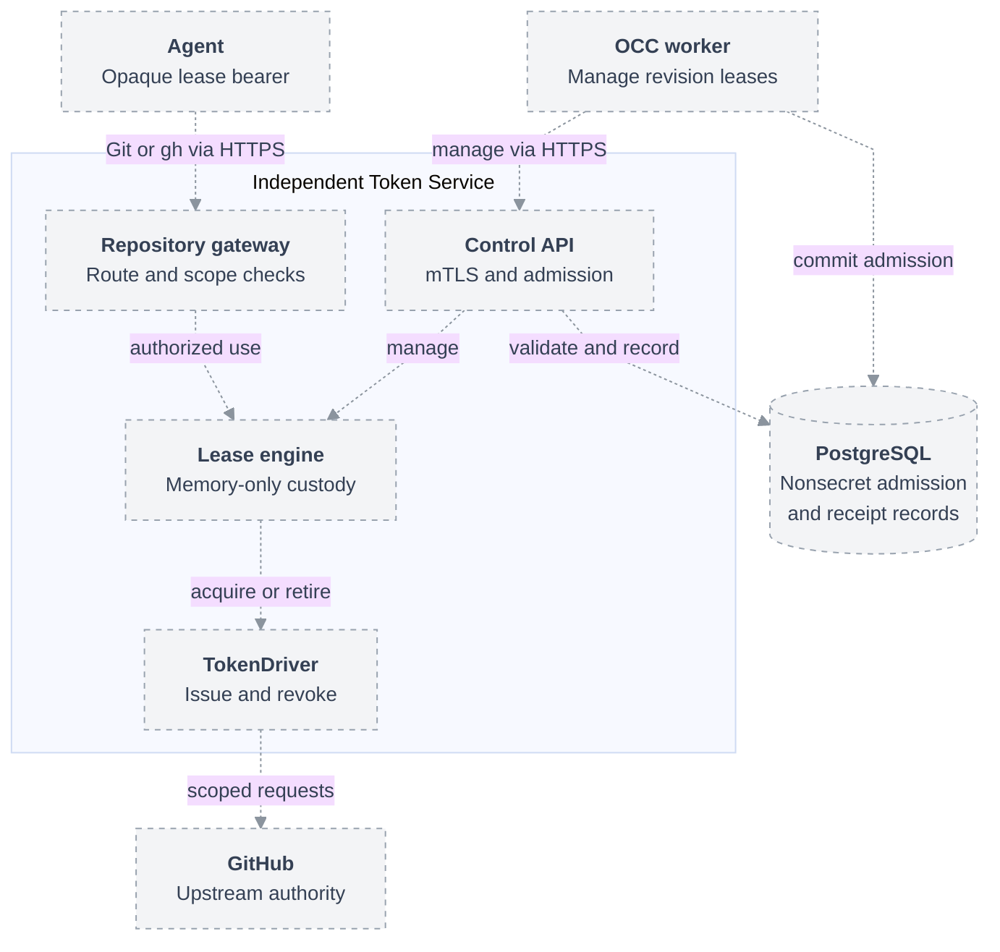

# Independent Token Service deployment

Deploy one active Token Service per Installation, separately from OCC workers.
Workers manage leases over authenticated HTTPS. Agents send Git/`gh` traffic
directly to its gateway using opaque lease bearers; the worker never proxies
that traffic. TokenDrivers and upstream credentials remain inside the service.
This is the proposed deployment contract for [RFC-0056](index.md).

## Topology

Dashed connections show the proposed integration, not implemented behavior.

The authenticated metadata caller uses the same control API with its separate
admission kind. It receives metadata results, never token material.

## Control authentication and configuration

Use separate control and gateway listeners, certificates, and network policies.
Only provisioned OCC callers can reach control; Agent networks can reach only
the gateway. Network reachability does not grant authority.

Control requires mTLS with a configured client CA and exact certificate URI SAN
matching a `control.clients[].identity` entry. `admissionKinds` limits that
identity's operations to revision or Installation-operation leases. URI values
are identifiers; this does not require a SPIFFE deployment. Reject unknown
identities, wrong admission kinds, invalid certificates, and gateway bearers on
control. Lease status and closure enforce the same owner and Installation
boundaries as admission. The bounded description operation requires an
Installation-operation admission; it cannot return lease credentials.

The `drivers.repo.configuration.controlClient` files are process-local mounts:
worker and API processes receive distinct certificates with their respective
configured identities, even when file paths match. The client verifies the
control server's hostname and CA. The service alone mounts control-server keys,
issuer keys, and its state database credential. Project configuration so workers
and API processes receive only their own private inputs and the nonsecret authority
configuration used to compute `configurationDigest`.

mTLS identifies a caller; it does not authorize arbitrary grants. OCC performs
IAM checks and commits a bound admission before calling control. The service
compares that record's owner, admission kind, `configurationDigest`, selected
grant and exact authority, authorization generation, deadline, and current
eligibility with the request and active configuration. Installation metadata
admission also records the requesting principal, Namespace, and exact approved
repository set; the service manages its internal leases through
`describeRepositories`, without exposing a metadata lease handle. Reject
missing, mismatched, expired, or withdrawn authority. Required validation and
receipt writes fail closed when their state is unavailable.

Agents retain opaque gateway authentication and cannot open leases or request
arbitrary scopes. Token replacement happens inside the service. No general
Agent-to-OCC authentication or public token-minting API is added.

## State and recovery

OCC owns authorized admission and retirement intent. A restricted service database
role reads the necessary admission records and writes service reservations,
bindings, and terminal receipts; it cannot edit IAM policy or Agent desired state.
Use atomic reservation under existing admission identities to serialize competing
workers. Return client material only after recording its binding. Retrying an
admission recovers status, never its bearer. A lost response retains the existing
find-or-fence/close semantics.

Remove the worker receipt server, reverse receipt callback, shared socket volume,
and coupled shutdown ordering. Keep the nonsecret record invariants. The service
records its own observed cleanup results directly; a failed write cannot become
successful disposal evidence. Closed leases stay closed while receipt recording
is retried.

Issued tokens and live leases remain in memory. There are no encrypted token
tables, persistent refresh-token store, or custody encryption key. Existing
operator-provisioned issuer credentials remain required.

Worker restarts reconnect to the same service without reminting tokens or
interrupting admitted Agent traffic. A service restart loses live leases and
invalidates their bearers. Lost upstream tokens may remain valid until expiry;
they cannot be recovered for use or revocation. Preserve terminal receipts from
the original service and unresolved cleanup records. Missing state, process exit,
and forward clock jumps never prove disposal.

Do not silently resume or remint lost leases. Replacement follows existing
explicitly authorized admission/revision rules and never settles previous cleanup
debt. Relaxing replacement gates while cleanup remains unresolved is a separate
policy decision, not implied by moving the service.

## Deployment and verification

Ship a separate Deployment and stable Service endpoints, with one active instance
and `Recreate` replacement. Worker scaling must not create more Token Service
instances. Stop the old instance before activating its replacement; ambiguous
termination blocks takeover. Forced deletion or loss of readiness is not proof
that the old process stopped. Multiple active replicas, distributed token caches,
and automatic failover are outside this proposal.

Worker upgrades leave Token Service Pods untouched. Service shutdown denies new
admissions and drains bounded cleanup independently of worker availability.
Service failure interrupts repository access across the Installation; report
that availability limit explicitly. Network policies restrict gateway consumers,
control callers, database access, and issuer egress separately.

Extend real Agent and PostgreSQL integration proof to cover:

- Worker restart with continuing Agent traffic and no replacement issuance.
- Distinct mTLS caller identities; rejection of wrong kinds, unauthorized grants,
  missing admission records, and Agent access to control.
- Concurrent admission, lost responses, database failure, and direct terminal
  receipts without a worker callback.
- Service restart rejecting old bearers and preserving unresolved cleanup;
  ambiguous old-instance termination blocking replacement.
- Packaged service placement, listener separation, enforced network policies,
  and issuer credentials confined to the service.

These are implementation acceptance requirements, not proof delivered by this RFC.
