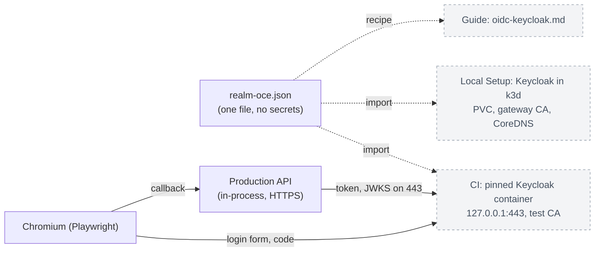

# Proposal: Verify Keycloak OIDC sign-in locally and in CI

- **ID:** RFC-0059
- **Owner:** freeqaz (proposal and auth review). CI and Local Setup review: OCE maintainers.
- **Created:** 2026-10-03
- **Last updated:** 2026-10-03
- **RFC PR:** _pending_
- **Related:** [RFC-0042](0042-oidc-sign-in.md) (generic OIDC sign-in; implementation
  [#790](https://github.com/openclaw/openclaw-enterprise/pull/790));
  [OIDC sign-in guide](../../docs/guides/deploy/oidc-sign-in.md); in-cluster IdP egress note
  [#903](https://github.com/openclaw/openclaw-enterprise/pull/903); token service
  [RFC-0056 (#924)](https://github.com/openclaw/openclaw-enterprise/pull/924);
  [RFC 39](39-sandbox-credential-injection.md) also wants a real Keycloak in tests.

## Summary

Keycloak is the only identity provider OCE has ever been checked against, twice by hand and
never by CI. This RFC makes it a **verified** provider with three pieces built from one
checked-in realm file: a Keycloak guide page that states what is verified and how to
configure the realm; an opt-in Kubernetes Local Setup sign-in profile that runs a pinned,
persistent Keycloak in the k3d cluster so developers sign in to the Console with eight-hour
OIDC sessions instead of the bootstrap password; and a CI lane that runs a pinned Keycloak
with that realm imported and drives the real browser flow end to end, including token
validation, key rotation, sign-out and refusals. Product authentication behaviour does not
change; the lane proves the production code path with no test-only knobs.

## Motivation

Every automated OIDC test uses the `fakeOidc` fixture
([production-sign-in.mjs](../../tests/helpers/production-sign-in.mjs)), which by its own
description proves OCE against its own reading of OIDC, not any IdP's behaviour. Keycloak
26.3 was exercised live for #790 from a host process and again on the dogfood install, where
it found two defects: the egress policy's port match (docs fix #903) and silent provider
outages (#806). Neither harness is in the repository, and the dogfood Keycloak runs
`start-dev` with an in-memory database and has already lost its realm. The
[guide](../../docs/guides/deploy/oidc-sign-in.md) gives Keycloak one table row and one line on
finding `sub`. RFC-0042's Auth0 live check never ran; Keycloak is the only real-issuer
evidence.

Locally, humans sign in to Local Setup with the generated administrator password, and
automation uses the 30-day bootstrap service key. `occ dev up` has no sign-in option;
enabling OIDC on the dogfood install took six hand-built workarounds.

## Goals

- **Supported Keycloak** means a documented realm and client recipe, a pinned Keycloak major
  version, and a named list of flows CI verifies against that version.
- **Local sign-in**: one environment variable gives a Kubernetes Local Setup install a
  Keycloak that survives restarts, with OCE configured for OIDC and the development
  administrator attached, so browser sessions are short-lived and passwords serve recovery
  only.
- **CI**: a hermetic lane with a digest-pinned Keycloak, a realm import, a real browser,
  deadline-bounded waits and no sleeps, covering the positive flow, both token-endpoint
  methods, key rotation, sign-out and refusals; the same script runs on a developer host.
- One realm file feeds the guide, the launcher and the lane, so documentation cannot drift
  from what is tested.

## Non-goals

- IdP-issued credentials for API clients (bearer tokens, token exchange, client credentials,
  device flow). Bearer authentication stays disabled
  ([auth/index.ts](../../apps/controller/src/auth/index.ts), `verify`); short-lived machine
  credentials are RFC-0056's territory.
- Claim, group or role mapping; just-in-time accounts; RP-initiated or back-channel logout;
  runtime discovery; private-key client authentication. RFC-0042's non-goals stand.
- New chart surface: no IdP CA value, no egress port knob, no relaxation of the
  https-on-443, DNS-name, single-host endpoint rules. The in-cluster egress workaround stays
  a documented extra NetworkPolicy.
- Changing the OIDC and native-admin exclusivity. OIDC supports host-only cookies only
  ([\_helpers.tpl](../../deploy/helm/openclaw-enterprise/templates/_helpers.tpl)), so the
  Keycloak profile has no embedded-Agent native admin chat.
- Keycloak as a production recipe: `start-dev` and the dev-file database are development and
  test tooling, and the guide says so.
- Verifying Auth0, Okta or Entra ID, or changing RFC-0042's status.

## Proposal

### One realm file

`tests/fixtures/keycloak/realm-oce.json` is a hand-edited Keycloak realm export that the
launcher and the lane import unchanged: realm `oce`; confidential client `oce-console` with
the authorization-code flow only, PKCE `S256` required, no implicit or direct grants, and one
redirect URI; client `oce-console-extra-audience`, identical plus an audience mapper, for the
negative case; and users `alice` and `carol` with fixed IDs, so their `sub` values are known.
It contains no secret: the redirect URI, client secret and user passwords are placeholders the
importer resolves from environment variables, which the launcher or the lane set from values
generated per run and kept in `0600` files. The image digest sits beside it in
`tests/fixtures/keycloak/image.json`; `prepare.mjs` and the launcher (which already reads the
chart from the checkout) both read it, so one bump changes both.

### What "supported" means

The guide gains a child page, `docs/guides/deploy/oidc-keycloak.md`, linked from its IdP
table: the pinned major version (26), the realm recipe as admin-console steps, the issuer form
`https://<host>/realms/<realm>`, where `sub` is shown, and the constraints the lane enforces.
The realm's default `RS256` key stays at 2,048 bits or more. The client has **no** audience
mapper, because OCE refuses an `aud` naming anything but the client. `KC_HOSTNAME` equals the
issuer URL exactly. The host name does not end in `.localhost` when the API runs in a Pod,
because the controller image resolves such names to loopback. The IdP is reached on 443 with
a certificate the API trusts. The page ends with the verified-flow table below and links
`docs/testing/keycloak.md`, which owns the lane, its environment variables and the local run.

### Local Setup sign-in profile

`OCC_DEVELOPMENT_SIGN_IN=keycloak`, read by `occ dev up` in the Kubernetes profile only (the
Docker profile has no ingress), adds to the install it already builds:

| Piece        | Shape                                                                                                                                                                                                                                                                                                                                                           |
| ------------ | --------------------------------------------------------------------------------------------------------------------------------------------------------------------------------------------------------------------------------------------------------------------------------------------------------------------------------------------------------------- |
| Keycloak     | Namespace `occ-development-keycloak`: the pinned image running `start-dev --import-realm` with `KC_DB=dev-file` on a PersistentVolumeClaim, the realm directory as a ConfigMap, and generated admin, client and user secrets. Import runs only when the realm is absent, so it survives Pod restarts; `occ dev down` removes the volume.                        |
| Name and TLS | `keycloak.occ-dev-<name>.oce.test`: a CoreDNS rewrite to the Envoy Gateway Service in-cluster, and a cert-manager Certificate from the gateway-routing CA that the chart already makes the API trust through `NODE_EXTRA_CA_CERTS`. The k3d cluster maps host `127.0.0.1:443` to that Gateway listener, the port the endpoint rules require.                    |
| Egress       | The extra API-to-Envoy-Pods NetworkPolicy on the Gateway's target port, as the guide documents for any in-cluster IdP.                                                                                                                                                                                                                                          |
| Chart values | Two Helm passes. The first bootstraps as today; the launcher then reads the administrator's user ID, attaches `alice`'s fixed subject to that account through the existing attach route (password sign-in, exact `Origin`), and upgrades with `auth.oidc.*`, `auth.recoveryUserId`, `auth.passwordSignIn: recovery-only` and `agentNativeAdmin.enabled: false`. |
| Developer    | Startup prints the Console URL, the `alice` password file and the one `/etc/hosts` line (`127.0.0.1 keycloak.occ-dev-<name>.oce.test`) the developer's browser needs; the API needs nothing on the host, and the printed browser CA covers the Keycloak certificate.                                                                                            |

Nothing here is new product surface: the chart values, the attach route, startup activation
and the NetworkPolicy shape are the documented ones. The dogfood install adopts this profile
and retires its hand-built Keycloak.

### CI lane

A new lane, `keycloak-oidc`, with one file,
`tests/integration/keycloak-oidc-sign-in.test.mjs`, and `prepare.keycloak: true`. Prepare
treats Keycloak like its PostgreSQL server: a tracked resource in the state file that cleanup
always removes, even after a failed run.

1. **Start.** Generate a two-day private CA and a leaf for `keycloak.oce.localhost` with
   `openssl` (as `routing.mjs` does), pull the pinned image through `pullImage`'s bounded
   retry, check it with `assertImmutableImageReference`, and run `start-dev --import-realm`
   with HTTPS on that leaf, `KC_HOSTNAME=https://keycloak.oce.localhost`, the realm directory
   mounted read-only, and the HTTPS port published on `127.0.0.1:443`. Docker binds the
   privileged port, so no `sudo` is needed. Prepare verifies that the host resolver
   synthesises `*.localhost` to loopback (systemd-resolved and nss-myhostname do; Chromium
   does so itself) and fails fast, naming the cause, when it does not or when 443 is taken.
   Readiness is the realm's discovery document returning the configured issuer, polled under
   a 180-second deadline; there are no fixed sleeps.
2. **Hand over.** The file receives `OCC_TEST_DATABASE_URL`, the issuer, the secret file
   paths, the container name and `NODE_EXTRA_CA_CERTS=<CA>`; Node reads the last at start,
   which is why prepare, not the test, sets it.
3. **Prove.** The test composes the production API in-process (`composeProductionSignIn`),
   serves it over HTTPS on a loopback origin with a leaf from the same CA, and drives a real
   Chromium through Playwright, already a `checks-browser` dependency. The browser fills
   Keycloak's real login form; the controller fetches the real token and JWKS endpoints over
   TLS on 443 with its unmodified transport. Requests are observed, never stubbed.

| Verified flow (one named test each)                                                                                                                                                                                                                |
| -------------------------------------------------------------------------------------------------------------------------------------------------------------------------------------------------------------------------------------------------- |
| Discovery matches the four configured values; the JWKS offers an `RS256` key of 2,048 bits or more with a `kid`.                                                                                                                                   |
| `alice`, attached, signs in through the Console: the authorization request carries `scope=openid`, `code_challenge_method=S256`, a nonce and the configured redirect URI; `/console/` loads with a session (`client_secret_post`).                 |
| The same with `client_secret_basic`, by recomposing the API with that setting.                                                                                                                                                                     |
| Adding a higher-priority realm key through the admin API changes the JWKS `kid`; the next sign-in succeeds with no controller restart.                                                                                                             |
| `carol`, not attached, lands on `/console/?authError=oidc`, is audited `EXTERNAL_IDENTITY_REJECTED`, and no account exists.                                                                                                                        |
| A sign-in through `oce-console-extra-audience` is refused for its extra `aud`, pinning the single-audience rule against a real Keycloak token.                                                                                                     |
| Console sign-out deletes the OCE session; one click signs `alice` in again without a login form while the Keycloak session lives. Disabling her in Keycloak leaves the OCE session until it ends locally and refuses the next sign-in at Keycloak. |
| Stopping the container fails sign-in closed with `PROVIDER_UNAVAILABLE` while the recovery password still signs in.                                                                                                                                |

The lane joins `scripts/ci/test-suites.json` and the `full` group at once and runs as its own
workflow job on `blacksmith-8vcpu-ubuntu-2404` with a 25-minute budget, not yet a
`CI Required` dependency, as [First Agent smoke](../../docs/testing/first-agent-smoke.md)
started. After the soak period below it moves into the `pr-safe` matrix and the `ci` group.
The suite audit applies from day one: the file lists its expected test names, and a skip
fails the lane.

### What changes for credentials

For humans, the Console session is the eight-hour, non-refreshing session RFC-0042 already
gives OIDC sign-in; the change is that Local Setup and dogfood can use it. Scoping stays OCE
IAM on the attached account; Keycloak decides only who may authenticate. For automation,
nothing changes: the bootstrap service key remains the API credential (its lifetime is
configuration, minimum one day), and IdP-issued machine credentials wait for RFC-0056 or a
successor.

### Security and failure

- Every secret is generated per run or per install and lives in `0600` files; the realm file
  holds none; the CA lives two days; Keycloak admin credentials never leave the lane or the
  launcher state directory.
- The lane adds no environment-gated behaviour to the controller or the chart: TLS trust
  uses the documented `NODE_EXTRA_CA_CERTS` path, host pinning and 443 are the real rules,
  and the fetch transport is the production one.
- A Keycloak that does not become ready, a changed login form, a digest mismatch or a busy
  port fails the lane with the step named; cleanup runs regardless of outcome.

Dashed edges are proposed; the browser and API edges are the existing sign-in flow.

## Rationale and alternatives

- **Extend `postgres-auth`**: rejected. Keycloak adds a 450 MB pull and a JVM start to a
  `CI Required` lane, and that lane's tests mock `globalThis.fetch` per test, which a
  real-IdP file must not share a process with.
- **A k3d lane with the chart** (NetworkPolicy, Pod DNS, Envoy, cert-manager): the most
  faithful proof and the only one that would have caught the D82 port match, at about ten
  minutes of cluster setup on the `ubuntu-22.04` runner. The launcher profile gives the same
  topology on demand; a lane that runs the profile is a later step, not a prerequisite.
- **Reach 443 by intercepting `fetch`** or an undici dispatcher: rejected; it proves a
  patched stack. **`unshare -rn`** as the #790 harness did: rejected for CI; Ubuntu 24.04
  restricts unprivileged user namespaces and the socket bridging is fragile.
- **A `*.localhost` name for the launcher**: rejected; the API Pod resolves it to loopback.
  The lane can use one because its API is a host process.
- **A Testcontainers dependency**: rejected; it hides the digest pin and the retry policy CI
  already standardises.

## Delivery and verification

Four pull requests in dependency order, each human-gated:

1. **Realm file, lane and testing page.** `realm-oce.json`, `image.json`,
   `prepare.keycloak`, the lane JSON, the test file, the workflow job,
   `docs/testing/keycloak.md` and the `ci.md` lane list. Evidence: the job green on the PR
   and on `main`; a developer-host run through `scripts/ci/run-tests.mjs run keycloak-oidc`;
   cleanup verified after a forced failure.
2. **Keycloak guide page.** The recipe, constraints and verified-flow table; the IdP table
   row links to it; `docs.json` and the cheat sheets updated. Evidence: `docs:check` and a
   read-through against the realm file.
3. **Launcher profile.** `OCC_DEVELOPMENT_SIGN_IN=keycloak`, its manifests, the two Helm
   passes, the attach step, the printed instructions, and the Local Setup and development
   settings pages. Evidence: a fresh `occ dev up` signs `alice` in through the Console,
   survives a Keycloak Pod restart with the realm intact, and `occ dev down` leaves nothing;
   the dogfood install switched to the profile.
4. **Promotion.** Move the lane into `pr-safe` and the `ci` group after the soak period.

Unverified after this RFC: Auth0, Okta and Entra ID; the chart's egress policy from a Pod in
CI (covered by the launcher profile and dogfood only); Keycloak versions other than the
pinned one.

## Risks

- **Keycloak cost and flakiness.** About 450 MB from `quay.io`, 15-40 s to start, ~1 GB of
  memory. Mitigations: digest pin, `pullImage` retry, deadline-bounded readiness, a
  dedicated lane, and non-required status until the soak proves it.
- **Login-form scraping.** Playwright selectors on Keycloak's login page break across
  versions; the digest pin makes this a reviewed change per bump.
- **Port 443 on developer hosts.** The lane and the profile both take loopback 443, so a host
  runs one at a time; prepare and the launcher fail fast when it is busy.
- **Resolver assumption.** The lane depends on `*.localhost` loopback synthesis on the
  runner. Prepare checks it first; the fallback is a hosts entry, which hosted runners allow.
- **Realm drift.** Import runs only on an empty database, so a changed realm file needs
  `occ dev down` with volumes; the launcher says so when it sees an older realm hash.

## Open questions

| Question                                                                        | Owner       | Proposed default                                                                            |
| ------------------------------------------------------------------------------- | ----------- | ------------------------------------------------------------------------------------------- |
| When does the lane become `CI Required`?                                        | freeqaz     | After two weeks of green runs on `main` with no infrastructure failure.                     |
| Should the dogfood install run the Keycloak profile permanently?                | freeqaz     | Yes, once PR 3 lands; the bootstrap key stays for automation until RFC-0056 or a successor. |
| Is a chart-topology Keycloak lane (k3d, NetworkPolicy, Pod DNS) worth its cost? | maintainers | Not now; revisit after promotion, reusing the launcher profile as the fixture.              |
| Keycloak version policy                                                         | maintainers | Pin 26.x by digest; bump with the other pinned images and re-check the login selectors.     |
| Relax the OIDC and native-admin exclusivity for development?                    | freeqaz     | No; it is a cookie-scope decision from RFC 31 and RFC-0042, not a tooling one.              |
